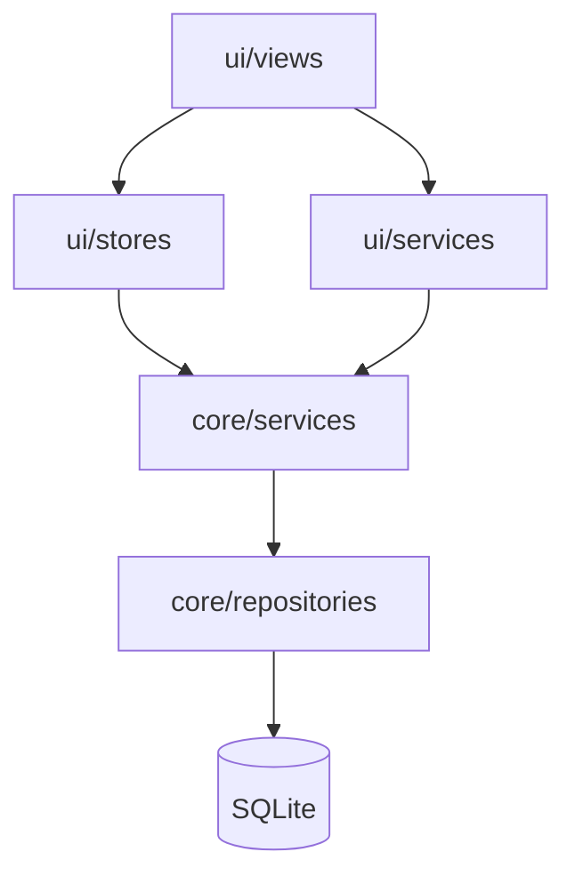

# Application Layers

## 概述

StrawMoneyBook frontend 採**分層架構**：UI 負責呈現與互動，Store 管理 reactive 狀態，Service 實作業務規則，Repository 封裝 SQL。Backend 則以 route handler → collab store → SQLite 為主線。

## 理想依賴方向

```text
ui/views
  → ui/stores
    → core/services
      → core/repositories
        → core/db

ui/services（runtime / sync / platform）
  → core/services + services/* API clients

backend/routes/*
  → backend/collab/*
    → collab-store.sqlite
```



## 各層職責

| 層級 | 目錄 | 職責 |
|---|---|---|
| View | `frontend/src/ui/views/` | 頁面、表單、路由級 UI |
| Component | `frontend/src/ui/components/` | 可重用 UI 區塊 |
| Store | `frontend/src/ui/stores/` | Pinia 狀態、action 委派 Service |
| UI Service | `frontend/src/ui/services/` | 啟動/runtime、同步、平台整合 |
| Core Service | `frontend/src/core/services/` | 領域業務邏輯（交易、預算、借貸…） |
| Repository | `frontend/src/core/repositories/` | SQL CRUD、查詢 |
| Domain | `frontend/src/core/domain/` | 純函式領域規則（posting、balance） |
| Shared API | `frontend/src/services/` | 對 backend / Google 的 HTTP client |

Backend：

| 層級 | 目錄 | 職責 |
|---|---|---|
| Route | `backend/src/routes/` | HTTP 入口、auth 檢查 |
| Collab | `backend/src/collab/` | 使用者、共同帳本、session store |

## 已知例外與收斂方向

依 [`architecture-review-smb-130.md`](https://github.com/StrawCoding/StrawMoneyBook/blob/main/docs/architecture-review-smb-130.md)：

| 問題 | 現況 | 收斂方向 |
|---|---|---|
| `core → ui` 反向依賴 | 部分 core service 曾直接碰 Pinia / router | bootstrap / membership 已拆出 UI 層協調 |
| View 直連 Repository | 分析、搜尋、日曆等頁曾直接 import repo | 統一走 `transaction-query.service.js` |
| 啟動邏輯過度集中 | `main.js` 堆疊過多 side effect | 拆到 `app-bootstrap` / `app-runtime` / `ledger-runtime` |
| Store 當 coordinator | `ledger.store` 曾負責 cross-store reset | 邏輯移至 `ledger-runtime.service.js` |
| Backend route 過胖 | auth / shared-ledgers 單檔過長 | 已拆成 `routes/auth/`、`routes/shared-ledgers/` 子目錄 |

::: tip 維護守則
- 頁面優先透過 Store 操作，不直接在 view 寫 DB  
- 交易查詢統一經 `transaction-query.service.js`  
- 業務規則改 Service，SQL 改 Repository  
- 日期 key 統一用 `core/utils/id.js` 的 helper
:::

## Backend 路由分派

[`backend/src/routes/route-table.js`](https://github.com/StrawCoding/StrawMoneyBook/blob/main/backend/src/routes/route-table.js) 將 pathname prefix 對應到 handler 模組：

- `/api/auth/*` — 登入、refresh、Google、Email
- `/api/shared-ledgers/*` — 共同帳本 CRUD、快照、邀請
- `/api/referrals/*` — 邀請碼、會員加成
- `/api/admin/*` — 管理後台

## 下一步

- [Startup & Runtime](/architecture/startup-and-runtime)
- [Frontend Stack](/guide/frontend-stack)
- [Data Model & Storage](/guide/data-model-and-storage)
