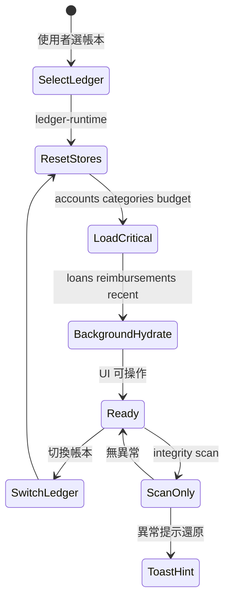

# Ledger Lifecycle

## 概述

StrawMoneyBook 幾乎所有功能都以**活動帳本（active ledger）**為上下文。帳本切換、reload、完整性檢查與跨 Store 重置，由 `ledger-runtime.service.js` 協調，而非單一 Store 獨揽。

## 核心概念

| 名詞 | 說明 |
|---|---|
| Active ledger | 目前 UI 操作的帳本 ID，存在 `ledger.store` |
| Ledger context | 帳本幣別、時區、預算期間模式（曆月 / 發薪週期） |
| Critical path reload | 切帳本後優先載入帳戶、分類、目前預算 |
| Integrity scan | 啟動 / 切帳本時掃描 FK、壞轉帳群組等（**只掃不修**） |
| Explicit repair | 使用者於資料管理頁確認後才執行的修復 |

## 生命週期流程

## Cross-Store 協調

切換帳本時，`ledger-runtime.service.js` 會重置或 reload 相關 Store：

| Store | 切換後行為 |
|---|---|
| `account.store` | 重載帳戶與群組統計 |
| `category.store` | 重載分類樹 |
| `transaction.store` | 清空快取、重載首頁範圍 |
| `budget.store` | `loadCurrentPeriod()` 解析發薪週期 key |
| `loan.store` / `reimbursement.store` | 背景 hydrate |

[`ledger.store.js`](https://github.com/StrawCoding/StrawMoneyBook/blob/main/frontend/src/ui/stores/ledger.store.js) 保留帳本 CRUD、活動帳本 ID、預算期間設定；cross-store 編排已外移到 runtime service。

## 預算期間與帳本時區

發薪週期帳本使用 `pay:YYYY-MM-DD` 形式的 `period_key`：

- [`budget.service.js`](https://github.com/StrawCoding/StrawMoneyBook/blob/main/frontend/src/core/services/budget.service.js) 的 `resolveCurrentBudgetPeriodForLedger()` 以**帳本時區**解析「今天」
- App resume / focus 時重新載入目前期間，避免跨發薪日仍顯示舊期
- 改發薪日或切換曆月 ↔ 發薪週期時，若新期無內容可 carry-forward 舊期結構

## Integrity：Scan vs Repair

::: warning smb297 後語意
- **Scan**：啟動 / 切帳本時只報告問題，不靜默改寫資料  
- **Repair**：必須在資料管理頁經使用者明示確認（含 audit reason）  
- **Sync replace**：Google Drive / 共同帳本替換本機時 `runIntegrityRepair: false`
:::

完整 wipe 僅允許明確 UX 路徑：重設全部資料、確認後 JSON 匯入、確認後雲端還原。且 wipe 前須建立 **verified durable recovery backup**，失敗則 `RECOVERY_BACKUP_REQUIRED` 中止。

## 與同步域的銜接

- 共同帳本 pull / push 以帳本 snapshot 為單位，合併前後需保留本機快照以便失敗回滾
- Google Drive 帳本同步使用三方合併（base + local dirty + remote）
- 詳見 [Sync, Backup & Shared Ledger](/domains/sync-backup-shared-ledger)

## 關鍵程式入口

| 模組 | 連結 |
|---|---|
| Ledger store | [`ledger.store.js`](https://github.com/StrawCoding/StrawMoneyBook/blob/main/frontend/src/ui/stores/ledger.store.js) |
| Ledger runtime | [`ledger-runtime.service.js`](https://github.com/StrawCoding/StrawMoneyBook/blob/main/frontend/src/ui/services/ledger-runtime.service.js) |
| Ledger repository | [`ledger.repo.js`](https://github.com/StrawCoding/StrawMoneyBook/blob/main/frontend/src/core/repositories/ledger.repo.js) |
| Repair（明示確認） | [`repair.service.js`](https://github.com/StrawCoding/StrawMoneyBook/blob/main/frontend/src/core/services/repair.service.js) |

## 下一步

- [Data Model & Storage](/guide/data-model-and-storage)
- [Budget](/domains/budget)
