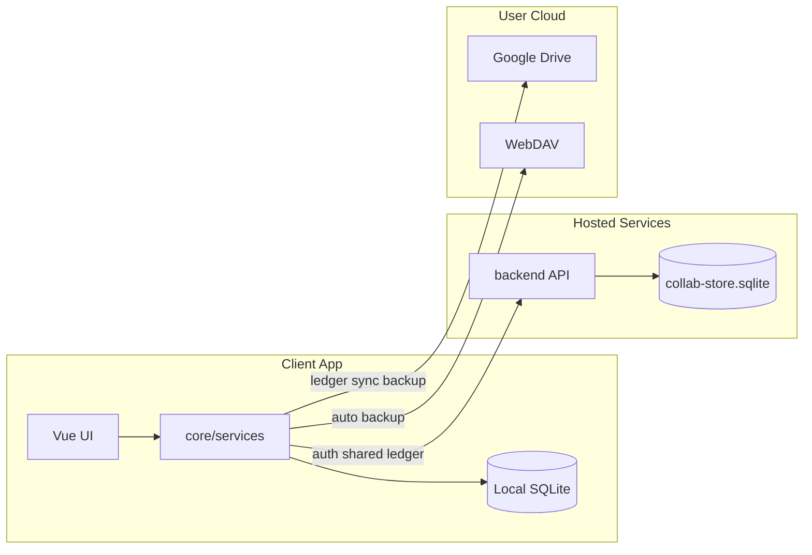

# Architecture Overview

## 概述

StrawMoneyBook 以**本機優先**為核心：帳本、交易、預算等資料主要存在 App 內 SQLite。雲端 backend 負責**帳號、共同帳本快照、會員與邀請碼**等協作能力；Google Drive / WebDAV 則提供使用者自管的備份與跨裝置帳本同步。

## 系統邊界

| 區塊 | 技術 | 職責 |
|---|---|---|
| `frontend/` | Vue 3、Vite、Pinia、Capacitor 8 | UI、本機業務邏輯、SQLite、Android 原生 |
| `backend/` | Node.js、better-sqlite3 | 帳號 session、共同帳本快照、邀請、會員 |
| 使用者雲端 | Google Drive AppData / WebDAV | 帳本 JSON 備份、逐帳本 GDrive 同步 |

## 技術棧

| 區域 | 技術 |
|---|---|
| Monorepo | npm scripts |
| Frontend | Vue 3、Vite、Pinia、Vue Router |
| App Runtime | Capacitor 8、Android（SQLCipher） |
| Local Data | SQLite / sql.js / WASM |
| Backend | Node.js、better-sqlite3 |
| 測試 | Node test runner、Vite build、Playwright |

## 資料所有權

- **帳本內容**（交易、帳戶、預算…）→ 本機 SQLite，使用者可匯出 JSON / 備份
- **帳號與共同帳本元資料** → backend `collab-store.sqlite`
- **跨裝置帳本副本** → Google Drive 快照檔（使用者 Google 帳號下）

::: warning 邊界不要混淆
Frontend Google Drive / WebDAV 備份是**使用者帳本**備份，不能取代 backend 的 `collab-store.sqlite`（帳號、密碼 hash、共同帳本伺服器狀態）。詳見主 repo [`docs/backup-strategy.md`](https://github.com/StrawCoding/StrawMoneyBook/blob/main/docs/backup-strategy.md) 的概念說明。
:::

## 核心設計原則

1. **活動帳本（active ledger）** 幾乎所有功能域的上下文
2. **Service 承載業務規則**，Repository 承載 SQL，Store 承載 UI 狀態
3. **同步與 wipe 需明確使用者確認**，禁止 silent repair / silent reset（smb297 後）
4. **查詢策略集中**：交易列表類功能應走 `transaction-query.service.js`

## 關鍵程式入口

| 用途 | 路徑 |
|---|---|
| 前端入口 | [`frontend/src/main.js`](https://github.com/StrawCoding/StrawMoneyBook/blob/main/frontend/src/main.js) |
| 後端入口 | [`backend/src/server.js`](https://github.com/StrawCoding/StrawMoneyBook/blob/main/backend/src/server.js) |
| 路由定義 | [`frontend/src/ui/router/index.js`](https://github.com/StrawCoding/StrawMoneyBook/blob/main/frontend/src/ui/router/index.js) |
| 架構審查紀錄 | [`docs/architecture-review-smb-130.md`](https://github.com/StrawCoding/StrawMoneyBook/blob/main/docs/architecture-review-smb-130.md) |

## 下一步

- [Application Layers](/architecture/application-layers) — 分層與依賴方向
- [Startup & Runtime](/architecture/startup-and-runtime) — 啟動鏈與背景排程
