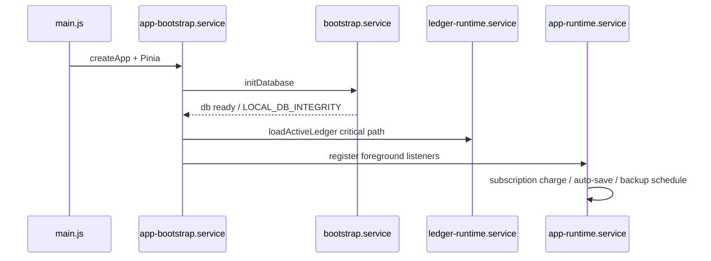

# Startup & Runtime

## 概述

App 啟動時需完成：SQLite 初始化、Pinia 建立、帳本 critical path 載入、以及背景 runtime（訂閱扣款、存錢罐、備份、共同帳本同步）。這些邏輯已從 `main.js` 拆到多個 bootstrap / runtime service，以便分層測試與擴充。

## 啟動鏈

| 階段 | 模組 | 職責 |
|---|---|---|
| 1 | [`main.js`](https://github.com/StrawCoding/StrawMoneyBook/blob/main/frontend/src/main.js) | 建立 Vue app、掛載 router、註冊 Capacitor plugin |
| 2 | [`app-bootstrap.service.js`](https://github.com/StrawCoding/StrawMoneyBook/blob/main/frontend/src/ui/services/app-bootstrap.service.js) | UI 啟動協調：接 core bootstrap、setup 流程判定 |
| 3 | [`bootstrap.service.js`](https://github.com/StrawCoding/StrawMoneyBook/blob/main/frontend/src/core/services/bootstrap.service.js) | DB 初始化、schema migration、降版保全 |
| 4 | [`ledger-runtime.service.js`](https://github.com/StrawCoding/StrawMoneyBook/blob/main/frontend/src/ui/services/ledger-runtime.service.js) | 帳本切換 reload、cross-store reset、integrity scan |
| 5 | [`app-runtime.service.js`](https://github.com/StrawCoding/StrawMoneyBook/blob/main/frontend/src/ui/services/app-runtime.service.js) | 前景事件、Android back、背景排程入口 |

## Critical Path vs 背景載入

帳本切換或 cold start 時，**critical path** 先完成：

1. 帳戶清單
2. 分類清單
3. 目前預算期間

其餘（借貸、報銷、附加範本、recent 交易）在背景 hydrate，縮短首屏時間。

## 背景 Runtime 觸發時機

[`app-runtime.service.js`](https://github.com/StrawCoding/StrawMoneyBook/blob/main/frontend/src/ui/services/app-runtime.service.js) 在以下時機補跑：

| 事件 | 典型動作 |
|---|---|
| App 啟動 | 訂閱今日扣款、存錢罐自動存入、預算存款、備份 due check |
| 回前景 / visibility | 發薪週期 rollover、GDrive 帳本同步、銀行 sync refresh |
| 帳本切換 | 重置 runtime token、重新排程 widget / 備份 |

相關 service：

- [`subscription-charge.service.js`](https://github.com/StrawCoding/StrawMoneyBook/blob/main/frontend/src/core/services/subscription-charge.service.js) — 訂閱冪等扣款
- [`savings-jar-auto-save.service.js`](https://github.com/StrawCoding/StrawMoneyBook/blob/main/frontend/src/core/services/savings-jar-auto-save.service.js) — 存錢罐到期存入
- [`auto-backup-orchestrator.service.js`](https://github.com/StrawCoding/StrawMoneyBook/blob/main/frontend/src/ui/services/auto-backup-orchestrator.service.js) — 備份 provider lock
- [`shared-ledger.service.js`](https://github.com/StrawCoding/StrawMoneyBook/blob/main/frontend/src/ui/services/shared-ledger.service.js) — 共同帳本背景 sync

## 資料庫啟動安全（smb297+）

::: warning 禁止 silent reset
`bootstrap.service.js` **不再**因 schema 錯誤或 FOREIGN KEY 失敗自動 `resetDatabase`。失敗改回傳 typed `LOCAL_DB_INTEGRITY`，引導使用者從備份還原。

Android `plugin-null` 時**禁止**切換到空的 recovery DB；只重試 primary，失敗才報錯。
:::

[`data-downgrade-guard`](https://github.com/StrawCoding/StrawMoneyBook/blob/main/frontend/src/core/services/) 會在本機 schema / App 版本高於目前二進位時阻擋開啟（`APP_DOWNGRADE_BLOCKED`），避免舊 APK 降版毀損資料。

## Composables 與 App Shell

| Composable | 用途 |
|---|---|
| [`useAppShellRuntime.js`](https://github.com/StrawCoding/StrawMoneyBook/blob/main/frontend/src/ui/composables/useAppShellRuntime.js) | Boot 狀態、route transition、安全鎖 lifecycle |
| [`useHomePeriodFilter.js`](https://github.com/StrawCoding/StrawMoneyBook/blob/main/frontend/src/ui/composables/useHomePeriodFilter.js) | 首頁期間篩選與預算同步 |

## 下一步

- [Ledger Lifecycle](/architecture/ledger-lifecycle)
- [Sync, Backup & Shared Ledger](/domains/sync-backup-shared-ledger)
