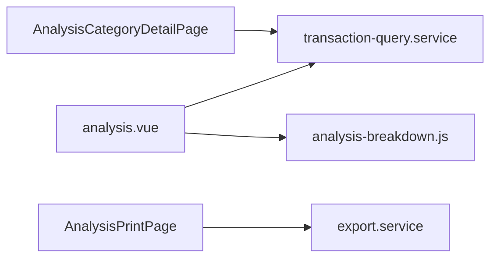

# Analysis & Reports

## 概述

分析域提供收支圖表、分類 / 帳戶 breakdown、CSV 匯出，以及圖示化 PDF 交易報表。查詢與彙總邏輯集中於 Service 層，避免各頁重複 SQL。

## 核心概念

| 概念 | 說明 |
|---|---|
| Scope | 全部 / 年 / 月 / 日 / 自訂期間 |
| Breakdown | 分類或帳戶維度的收入 / 支出彙總 |
| 淨額退款 | 部分退款以扣除後淨額納入分析 |
| 互動 vs 列印 | `/analysis` 跟隨 Dark/Light；PDF 強制淺色 |

## 協作流程

## 主要頁面

| 路由 | 頁面 | 用途 |
|---|---|---|
| `/analysis` | `analysis.vue` | 圓餅 / 長條圖、摘要、一鍵 PDF |
| `/analysis/category` | `AnalysisCategoryDetailPage` | 分類明細 |
| `/analysis/print` | `AnalysisPrintPage` | 交易報表預覽、PDF / CSV |

PDF 產生：html2canvas + jsPDF，檔名 `交易報表_YYYY-MM.pdf`；擷取前強制 A4 寬度與等比分頁。

## 關鍵模組

| 模組 | 職責 |
|---|---|
| [`transaction-query.service.js`](https://github.com/StrawCoding/StrawMoneyBook/blob/main/frontend/src/core/services/transaction-query.service.js) | 期間內交易查詢（含 chunked + 讓出主執行緒） |
| [`analysis-breakdown.js`](https://github.com/StrawCoding/StrawMoneyBook/blob/main/frontend/src/core/utils/analysis-breakdown.js) | 圓餅 / 長條 / 日別 breakdown 計算 |
| [`export.service.js`](https://github.com/StrawCoding/StrawMoneyBook/blob/main/frontend/src/core/services/export.service.js) | CSV / Spreadsheet / 報表資料 |

## 查詢效能

- 首頁 / 搜尋 / 帳戶明細：SQL **分頁 300 筆**，badge 顯示總筆數
- 分析「全部」範圍：chunked 載入 + 讓出主執行緒，避免大型帳本卡 UI
- 收支摘要：`summarizeHomeAssetTotalsByScope` 單次 SQL（見 [Budget](/domains/budget)）

## 支出附加項目

正向附加項目在分類分析中拆成獨立列，主分類扣除附加金額後總支出仍一致（SMB-146）。

## 與其他域

- **預算**：分析頁可顯示預算達成卡
- **資產**：投資 / 證券摘要
- **記帳**：`include_in_analysis` 與 `loan_payment` 排除規則

## 下一步

- [Bookkeeping](/domains/bookkeeping)
- [Frontend Stack](/guide/frontend-stack)
