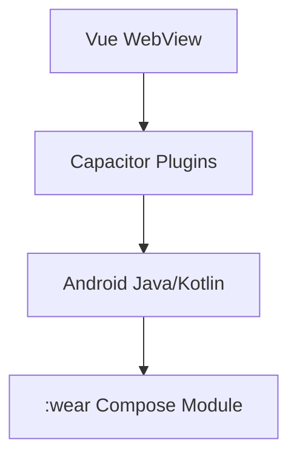

# Android & Capacitor

## 概述

StrawMoneyBook 以 **Capacitor 8** 包裝 Vue SPA 為 Android App，並透過原生 plugin 整合 Google Identity、SQLite SQLCipher、桌面小工具、Wear OS companion、安全鎖與銀行自動化等能力。

## Capacitor 架構

入口：[`frontend/android/`](https://github.com/StrawCoding/StrawMoneyBook/tree/main/frontend/android)

## 本機資料（Android）

- SQLCipher 加密：`straw_money_bookSQLite.db`
- 初始化：Capacitor SQLite plugin + [`bootstrap.service.js`](/architecture/startup-and-runtime)
- plugin-null 時只重試 primary DB，禁止切空 recovery DB（smb298）

## 原生 Plugin（節錄）

| Plugin / 類別 | 用途 |
|---|---|
| [`GoogleIdentityPlugin.java`](https://github.com/StrawCoding/StrawMoneyBook/blob/main/frontend/android/app/src/main/java/com/strawcoding/strawmoneybook/GoogleIdentityPlugin.java) | Google 登入、server auth code |
| [`MainActivity.java`](https://github.com/StrawCoding/StrawMoneyBook/blob/main/frontend/android/app/src/main/java/com/strawcoding/strawmoneybook/MainActivity.java) | OAuth result 轉送 |
| HomeWidget plugin | 5 種桌面小工具 |
| Local Notifications | 記帳提醒 |

## 桌面小工具

| Provider | 用途 | 點擊導向 |
|---|---|---|
| `StrawMoneyWidgetProvider` | 月收支總覽 | `/analysis` |
| `StrawMoneyPieChartWidgetProvider` | 圓餅圖 | `/analysis` |
| `StrawMoneyBarChartWidgetProvider` | 長條圖 | `/analysis` |
| `StrawMoneyQuickAddWidgetProvider` | 快速記帳 | `/transactions/quick-add` |
| `StrawMoneyAiBookkeepingWidgetProvider` | AI 記帳 | `/ai-auto-bookkeeping` |

資料由 [`home-widget.service.js`](https://github.com/StrawCoding/StrawMoneyBook/blob/main/frontend/src/ui/services/home-widget.service.js) 寫入 SharedPreferences，原生繪製 Bitmap。

## Wear OS Companion

- 獨立 `:wear` Compose 模組 + Tile
- MessageClient `/smb/v1/*` nearby-first，寫入同一 SQLCipher DB（不經 WebView）
- Room outbox v2；Wear Compose **1.6.2**（禁 1.4.x + targetSdk≥35 閃退）
- Play 測試 / 正式分軌上傳（phone + wear 各一 AAB）

## 安全與 UX

| 能力 | Service |
|---|---|
| 生物辨識鎖 | [`security-lock.service.js`](https://github.com/StrawCoding/StrawMoneyBook/blob/main/frontend/src/ui/services/security-lock.service.js) |
| Android 返回鍵 | [`app-runtime.service.js`](/architecture/startup-and-runtime) |
| 語音輸入 | AI 記帳整合 Capacitor speech |
| 主題 / modern UI | [`theme.service.js`](https://github.com/StrawCoding/StrawMoneyBook/blob/main/frontend/src/ui/services/theme.service.js)、[`apple-ui.css`](https://github.com/StrawCoding/StrawMoneyBook/blob/main/frontend/src/ui/assets/css/apple-ui.css) |

## Web 測試版

Production web SPA：`https://www.strawmb.com/app/`（hash router，`VITE_WEB_HASH_ROUTER=true`），連 `api.strawmb.com`。本機 `npm run dev` 亦預設連營運 API。

## 與其他域

- [Authentication](/guide/authentication) — Google Identity、server auth code
- [Bank Sync](/domains/bank-sync-einvoice) — 原生銀行自動化
- [Bookkeeping](/domains/bookkeeping) — Wear 記帳寫入同一 DB

## 下一步

- [Frontend Stack](/guide/frontend-stack)
- [Startup & Runtime](/architecture/startup-and-runtime)
