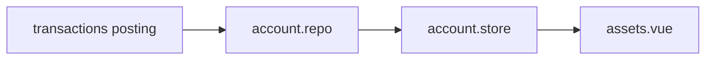

# Assets

## 概述

資產域管理帳戶餘額、帳戶群組、總資產 / 可支配 / 負債摘要，並延伸**有價證券**與**信用卡**等專子域。所有餘額計算最終來自交易 posting 與帳戶 metadata。

## 核心概念

| 概念 | 說明 |
|---|---|
| Account | 資產 / 負債帳戶，可設群組、匯率、納入統計開關 |
| Account group | 群組內摘要，支援外幣 snapshot 換算 |
| Securities | 有價證券持倉、T+2 交割、已實現 / 未實現損益 |
| Credit card | 獨立於資產母分類，帳單 / 還款 allocations |
| include_in_group_statistics | 帳戶層級是否納入群組加總 |

## 協作流程（帳戶餘額）

[`account.store.js`](https://github.com/StrawCoding/StrawMoneyBook/blob/main/frontend/src/ui/stores/account.store.js) 提供清單、餘額、群組統計；負向負債帳戶以絕對值納入負債摘要。

## 主要頁面

| 路由 | 頁面 | 用途 |
|---|---|---|
| `/assets` | `assets.vue` | 總覽卡（總資產、可支配、借出借入、證券、信用卡） |
| `/assets/accounts` | `AssetAccountManagementPage` | 帳戶 CRUD |
| `/assets/account-groups/:id` | `AssetAccountGroupDetailPage` | 群組管理 |
| `/accounts/:id` | `AccountDetailPage` | 帳戶明細（交易分頁 300 + 餘額校正） |
| `/assets/securities` | `SecuritiesListPage` | 有價證券 |
| `/credit-cards` | `CreditCardsPage` | 信用卡帳單與還款 |

## 有價證券（Securities v2）

關鍵規則：

- 交割帳戶綁 `settlement_account_id`，T+2 10:00 排程交割
- 本金不計收支；已實現損益記「投資損益」
- 總資產依未實現模式計入**已確認**市值或成本
- 交割改期 / 取消 / 提前確認需原子回滾現金 + 損益腿

Domain 邏輯：[`core/domain/posting/`](https://github.com/StrawCoding/StrawMoneyBook/tree/main/frontend/src/core/domain/posting)

## 信用卡

- 刷卡 = 一般記帳選信用卡帳戶（createExpense → 刷卡雙腿）
- 帳單 posting、還款 allocations、closed 期間編輯限制
- 入口：`updateManualTransaction` + `findTransactionRecordById`

## Repository

[`account.repo.js`](https://github.com/StrawCoding/StrawMoneyBook/blob/main/frontend/src/core/repositories/account.repo.js) — 餘額計算、封存 / 刪除（含 soft-delete FK 檢查）

## 與其他域

- **記帳**：所有帳戶變動來自 [`transaction.service`](/domains/bookkeeping)
- **借貸**：借出 / 借入影響資產卡借出借入區塊
- **分析**：投資 / 證券摘要出現在分析頁
- **同步**：`securities` / `security_transactions` 含在快照匯出

## 下一步

- [Bookkeeping](/domains/bookkeeping)
- [Loans, Reimbursements & Claims](/domains/loans-reimbursements-claims)
