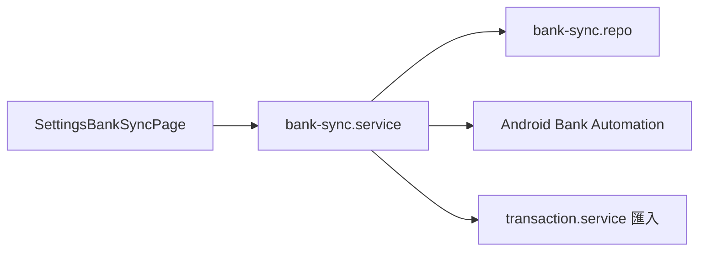

# Bank Sync & E-Invoice

## 概述

**銀行同步**與**載具（電子發票）**為會員限定進階功能。銀行端以 Android 原生自動化為主；載具查詢改由 backend 代理財政部 API，前端 wizard 引導驗證與匯入。

## 銀行同步

### 核心概念

| 概念 | 說明 |
|---|---|
| Connection | 銀行連線設定（憑證加密儲存） |
| runtimeJobs | 同連線合併防重入 |
| possible_duplicate_of | 跨來源同日同額標記，預設不匯入 |
| 支援矩陣 | Web 顯示可讀矩陣 + CSV 退路 |

### 協作

| 模組 | 連結 |
|---|---|
| Service | [`bank-sync.service.js`](https://github.com/StrawCoding/StrawMoneyBook/blob/main/frontend/src/ui/services/bank-sync.service.js) |
| Auto refresh | [`bank-sync-auto-refresh.service.js`](https://github.com/StrawCoding/StrawMoneyBook/blob/main/frontend/src/ui/services/bank-sync-auto-refresh.service.js) |
| Repo | [`bank-sync.repo.js`](https://github.com/StrawCoding/StrawMoneyBook/blob/main/frontend/src/core/repositories/bank-sync.repo.js) |
| 憑證加密 | [`secure-setting.service.js`](https://github.com/StrawCoding/StrawMoneyBook/blob/main/frontend/src/ui/services/secure-setting.service.js) |

第一銀行自動登入目前僅 **Android 原生**；Web 不提供靜默導回。

架構審計文件：[`docs/audits/bank-sync-20260816/`](https://github.com/StrawCoding/StrawMoneyBook/tree/main/docs/audits/bank-sync-20260816)

## 載具 / 電子發票

### 流程

1. Step 1：手機條碼 + 查詢碼驗證
2. Step 2：日期區間查詢（預設最近 62 天）
3. 選取發票 → 可選帳戶 / 分類 → 建立支出交易

Backend 代理：[`/api/einvoice/query-invoices`](https://github.com/StrawCoding/StrawMoneyBook/tree/main/backend/src/routes)（詳見 repo einvoice 路由）

前端 wizard：[`frontend/src/ui/views/einvoice/`](https://github.com/StrawCoding/StrawMoneyBook/tree/main/frontend/src/ui/views/einvoice)

### 可用性面板

資格 → 平台 → API health → 憑證 → captcha → 同步 → 審核；captcha 可刷新 / 取消 / 到期提示。

## 同步合約自檢（Backend）

`backend/scripts/sync-contract-check-run.mjs` 編排載具 + 銀行 portal 錨點探測，CI cron 與主機腳本共用，避免外部 HTML 結構漂移導致 silent break。

## 與其他域

- **Membership**：功能 gating
- **Bookkeeping**：匯入結果寫入 transactions
- **Settings**：進階功能入口在 [`FeatureListPage.vue`](https://github.com/StrawCoding/StrawMoneyBook/blob/main/frontend/src/ui/views/FeatureListPage.vue)

## 下一步

- [Membership](/domains/membership)
- [Android & Capacitor](/domains/android-capacitor)
