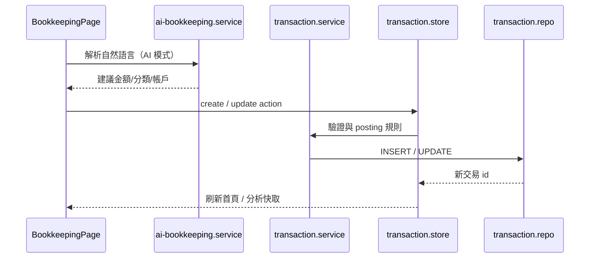

# Bookkeeping

## 概述

記帳域是 StrawMoneyBook 的核心：支援 **AI 自動記帳、手動快速新增、問答記帳** 三種入口，統一寫入 `transactions` 表，並與預算、分析、借貸、報銷等域透過交易 metadata 銜接。

## 核心概念

| 概念 | 說明 |
|---|---|
| Transaction | 收入 / 支出 / 轉帳等單筆或雙腿記錄 |
| Origin type | 標記來源（一般、借貸還款、訂閱扣款…） |
| Addon items | 附加項目（折價、手續費）可抵消主金額至 0 |
| Refund | 部分 / 全額退款，淨額納入分析與預算 |
| include_in_analysis | 是否計入收支分析與預算 |

## 三種記帳模式

| 模式 | 路由 | 頁面 |
|---|---|---|
| AI 記帳 | `/ai-auto-bookkeeping` | `AiAutoBookkeepingPage.vue` |
| 手動快速新增 | `/transactions/quick-add` | `QuickAddPage.vue` |
| 問答記帳 | `/transactions/qna` | `QnaBookkeepingPage.vue` |

三者共用 [`BookkeepingPage.vue`](https://github.com/StrawCoding/StrawMoneyBook/blob/main/frontend/src/ui/views/BookkeepingPage.vue) 外殼。

## 協作流程

## 關鍵 Service

| Service | 職責 |
|---|---|
| [`transaction.service.js`](https://github.com/StrawCoding/StrawMoneyBook/blob/main/frontend/src/core/services/transaction.service.js) | 建立收入/支出/轉帳/退款、刪除關聯 |
| [`transaction-query.service.js`](https://github.com/StrawCoding/StrawMoneyBook/blob/main/frontend/src/core/services/transaction-query.service.js) | 各頁統一查詢 |
| [`ai-bookkeeping.service.js`](https://github.com/StrawCoding/StrawMoneyBook/blob/main/frontend/src/core/services/ai-bookkeeping.service.js) | 文字 / 語音解析 |
| [`ai-bookkeeping-tiny-ner.service.js`](https://github.com/StrawCoding/StrawMoneyBook/blob/main/frontend/src/core/services/ai-bookkeeping-tiny-ner.service.js) | 輕量實體抽取 |

AI 金額四則與手動計算機共用 `amount-expression` 求值；分類 / 帳戶比對見 `ai-bookkeeping-category-match.js`、`ai-bookkeeping-account-match.js`。

## 交易生命週期頁面

| 路由 | 頁面 | 用途 |
|---|---|---|
| `/transactions/search` | `TransactionSearchPage` | 搜尋、批量編輯（SQL 分頁 300） |
| `/transactions/calendar` | `CalendarPage` | 日曆檢視 |
| `/transactions/:id` | `TransactionAboutPage` | 明細、退款 |
| `/transactions/:id/edit` | `TransactionEditPage` | 編輯（含計算機輸入） |

Composable：[`useTransactionSearchPage.js`](https://github.com/StrawCoding/StrawMoneyBook/blob/main/frontend/src/ui/composables/useTransactionSearchPage.js)

## 與其他域的銜接

- **預算**：交易 `include_in_analysis`、分類預設 flags 影響預算已用
- **借貸**：`origin_type=loan_payment` 的還款交易
- **報銷**：`is_reimbursable`、自訂 `reimburse_target_minor`
- **訂閱**：`subscription-charge.service` 冪等建立支出
- **有價證券 / 信用卡**：specialized posting 見 [Assets](/domains/assets)

::: tip 刪除行為
刪除交易成功後 `replace` 回首頁並還原捲動；詳情頁若交易已不存在亦導回首頁（smb292）。
:::

## 下一步

- [Budget](/domains/budget)
- [Analysis & Reports](/domains/analysis-reports)
