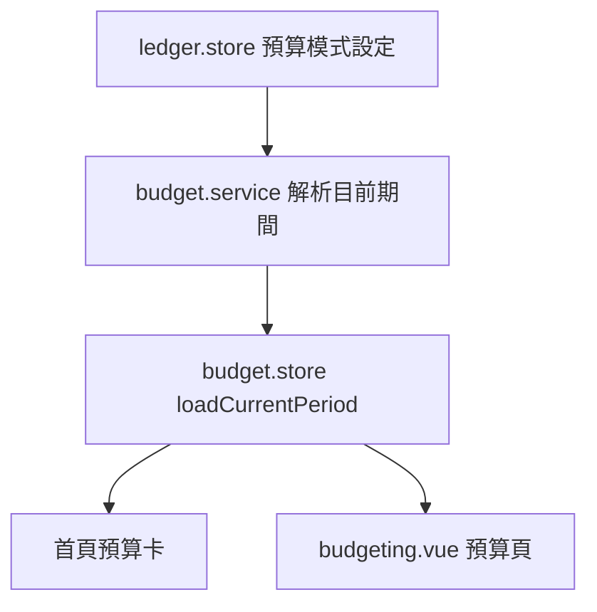

# Budget

## 概述

預算域管理**曆月**與**發薪週期**兩種期間模式，支援一般分類項目、共同預算池、日均規則、保留金額，以及預算剩餘自動转入存錢罐。

## 核心概念

| 概念 | 說明 |
|---|---|
| period_key | 期間唯一鍵（`YYYY-MM` 或 `pay:YYYY-MM-DD`） |
| 共同預算池 | 多分類共享池額度，支援 2B 月總額、3C 超支 |
| 保留金 reserve | 依日均規則即時計算的不可用額度 |
| budget_container_month | 池層預算存款 |
| carry-forward | 改發薪日 / 切換模式時帶入舊期結構 |

## 期間模式

- **曆月**：`period_key = YYYY-MM`
- **發薪週期**：以固定每月發薪日錨定，`pay:YYYY-MM-DD` 或含起訖的複合 key
- 「今天」一律以**帳本時區**解析（`resolveCurrentBudgetPeriodForLedger`）

App resume / focus 時重新載入目前期間，避免跨發薪日 stale period。

## 關鍵 Service / Store

| 模組 | 職責 |
|---|---|
| [`budget.store.js`](https://github.com/StrawCoding/StrawMoneyBook/blob/main/frontend/src/ui/stores/budget.store.js) | 期間狀態、共同池 getter、sheet 儲存 |
| [`budget.service.js`](https://github.com/StrawCoding/StrawMoneyBook/blob/main/frontend/src/core/services/budget.service.js) | 期間解析、跨月建立、carry-forward |
| [`budget-reserve.service.js`](https://github.com/StrawCoding/StrawMoneyBook/blob/main/frontend/src/core/services/budget-reserve.service.js) | 保留金即時計算 |
| [`budget-save.service.js`](https://github.com/StrawCoding/StrawMoneyBook/blob/main/frontend/src/core/services/budget-save.service.js) | 期間結束結算、自動存罐 |
| [`budget.repo.js`](https://github.com/StrawCoding/StrawMoneyBook/blob/main/frontend/src/core/repositories/budget.repo.js) | SQL 持久化 |

UI 入口：[`budgeting.vue`](https://github.com/StrawCoding/StrawMoneyBook/blob/main/frontend/src/ui/views/budgeting.vue)（路由 `/budget`）

## 與首頁的協作

首頁預算簡表與 [`useHomePeriodFilter.js`](https://github.com/StrawCoding/StrawMoneyBook/blob/main/frontend/src/ui/composables/useHomePeriodFilter.js) 同步：

- 發薪週期帳本的首頁月份篩選**不覆寫**預算期間 key
- reload 成功後廣播 `app:budget-period-sync`

收支摘要由 `summarizeHomeAssetTotalsByScope` 單次 SQL 彙總（含退款淨額），不再分頁掃全表。

## 跨月建立

「套用至月份」fan-out 為每月獨立 budget/container/item，建立前檢查目標月同名池或同分類衝突，避免 partial write。

## 與存錢罐的銜接

[`budget-save.service.js`](https://github.com/StrawCoding/StrawMoneyBook/blob/main/frontend/src/core/services/budget-save.service.js) 在期間結束後將剩餘額結算，可自動写入 [`savings-jar.service.js`](https://github.com/StrawCoding/StrawMoneyBook/blob/main/frontend/src/core/services/savings-jar.service.js) 指定的存錢罐。

## 下一步

- [Ledger Lifecycle](/architecture/ledger-lifecycle)
- [Bookkeeping](/domains/bookkeeping)
