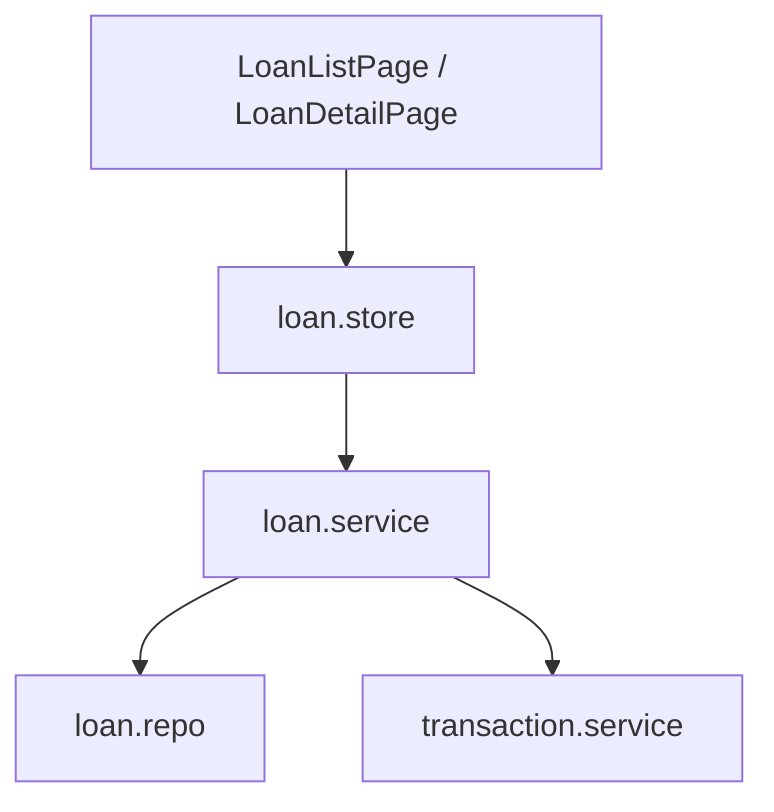

# Loans, Reimbursements & Claims

## 概述

此域涵蓋**借貸追蹤**、**可報銷支出流程**與**請款單**三大相連工作流。請款單可導入報銷項目或未完成借出，完成時回寫來源狀態或消除借出。

## 借貸（Loans）

### 核心概念

| 概念 | 說明 |
|---|---|
| direction | `lend`（借出）/ `borrow`（借入） |
| loan_payment | 還款交易，`origin_type=loan_payment` |
| 利息 | 超出本金部分自動拆為利息收入 / 支出 |
| 預設不計分析 | 借貸 setup 與還款預設 `include_in_analysis=false` |

### 協作

| 模組 | 連結 |
|---|---|
| Store | [`loan.store.js`](https://github.com/StrawCoding/StrawMoneyBook/blob/main/frontend/src/ui/stores/loan.store.js) |
| Service | [`loan.service.js`](https://github.com/StrawCoding/StrawMoneyBook/blob/main/frontend/src/core/services/loan.service.js) |
| Repo | [`loan.repo.js`](https://github.com/StrawCoding/StrawMoneyBook/blob/main/frontend/src/core/repositories/loan.repo.js) |

對象明細頁 [`LoanCounterpartyDetailPage.vue`](https://github.com/StrawCoding/StrawMoneyBook/blob/main/frontend/src/ui/views/loans/LoanCounterpartyDetailPage.vue) 提供快速新增借出 / 借入。

## 報銷（Reimbursements）

- 可報銷交易標記 `is_reimbursable`
- 自訂報銷金額存 `reimburse_target_minor`（未設則用原始支出）
- 代收 / 預支：部分抵扣仍保留可用餘額的代收

[`reimbursement.service.js`](https://github.com/StrawCoding/StrawMoneyBook/blob/main/frontend/src/core/services/reimbursement.service.js) 處理入帳、請款完成後的 `reimbursed_minor` 累計。

## 請款單（Claim Sheets）

### 導入流程

| 類型 | 路由 | 說明 |
|---|---|---|
| 導入報銷 | `/claim-sheets/:id/import-reimbursements` | 獨立選取頁，可編輯「本次請款金額」 |
| 導入借出 | `/claim-sheets/:id/import-borrow-loans` | 僅未完成借出，金額 = 剩餘未收回 |

Draft session 分別保存 `importAmountOverrides` / `borrowLoanImportAmountOverrides`。

### 草稿同步

[`claim-sheet-draft-sync.service.js`](https://github.com/StrawCoding/StrawMoneyBook/blob/main/frontend/src/core/services/claim-sheet-draft-sync.service.js) 的 `reconcileDraftClaimSheetImportItems`：

- 來源交易修改報銷金額、刪除、取消可報銷時，自動更新 draft 請款單 import items
- 僅影響 `status=draft` 請款單

### 完成請款與借出消除

完成請款時，borrow_loan 類 claim items 對應借出會被整套消除（軟刪 setup 交易、刪還款、軟刪 loan）；從 paid 退回 draft 或刪除 paid 請款單時 `restoreBorrowLoanClaimSources` 復原。

## 頁面索引

| 路由 | 用途 |
|---|---|
| `/loans` | 借貸清單 |
| `/reimbursements` | 報銷清單 |
| `/claim-sheets` | 請款單清單 |
| `/claim-sheets/:id/edit` | 建立 / 編輯請款單 |

## 下一步

- [Bookkeeping](/domains/bookkeeping)
- [Analysis & Reports](/domains/analysis-reports)
