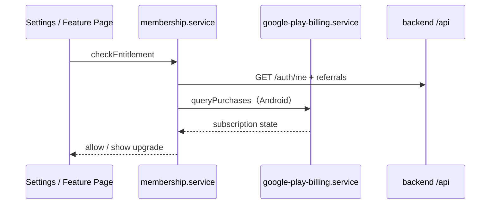

# Membership

## 概述

會員域控制功能限制（AI 次數、銀行同步、載具等）、Google Play 訂閱狀態，以及邀請碼天數加成。Backend 為 membership grant 權威；Frontend 快取並在操作前檢查。

## 核心概念

| 概念 | 說明 |
|---|---|
| Membership tier | 免費 / 付費等級與 entitlement |
| Google Play Billing | Android 內購、恢復購買 |
| Referral code | 邀請者 +7 天、被邀請者 +3 天 |
| Session gate | 共同帳本 sync 前 `ensureSharedLedgerSessionReady` |

## 協作流程

## 關鍵模組

| 模組 | 職責 |
|---|---|
| [`membership.service.js`](https://github.com/StrawCoding/StrawMoneyBook/blob/main/frontend/src/core/services/membership.service.js) | 等級、限制、Play 狀態、snapshot 判定 |
| [`google-play-billing.service.js`](https://github.com/StrawCoding/StrawMoneyBook/blob/main/frontend/src/core/services/google-play-billing.service.js) | 方案查詢、購買、恢復 |
| [`membership-navigation.service.js`](https://github.com/StrawCoding/StrawMoneyBook/blob/main/frontend/src/ui/services/membership-navigation.service.js) | 限制時導頁（router 留 UI 層） |
| Backend [`routes/referrals.js`](https://github.com/StrawCoding/StrawMoneyBook/blob/main/backend/src/routes/referrals.js) | 邀請碼兌換、加成發放 |

## 會員限定功能（節錄）

- AI 自動記帳次數
- 銀行同步（`VITE_BANK_SYNC_FEATURE_ENABLED`）
- 載具 / 電子發票同步
- 部分進階同步能力

設定入口：[`SettingsAccountPage.vue`](https://github.com/StrawCoding/StrawMoneyBook/blob/main/frontend/src/ui/views/settings/SettingsAccountPage.vue)（推薦碼、Google 綁定）

## 與 Auth 的關係

須先登入才能兌換邀請碼；共同帳本背景 sync 在 session 恢復中 / 需 reauth 時寫入可見 `paused_*` 狀態，禁止 silent no-op。

## 下一步

- [Authentication](/guide/authentication)
- [Bank Sync & E-Invoice](/domains/bank-sync-einvoice)
