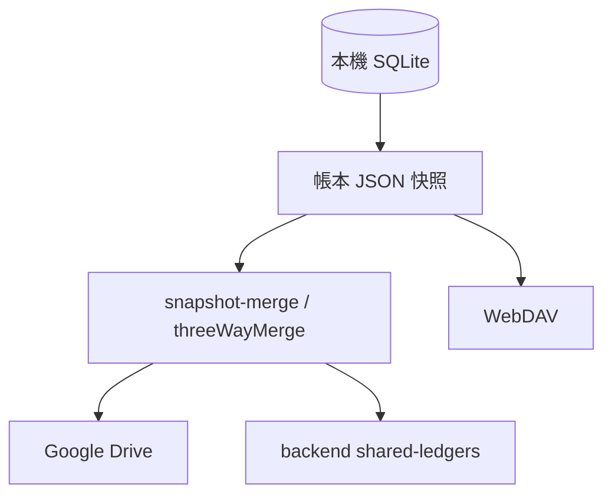

# Sync, Backup & Shared Ledger

## 概述

此域涵蓋三條**資料離開本機**的路徑：使用者自管 **Google Drive / WebDAV 備份**、**Google Drive 帳本同步**，以及 **共同帳本（Shared Ledger）** 與 backend 協作。三者共用快照格式與合併邏輯，但觸發與權限模型不同。

## 三條路徑對照

| 路徑 | 儲存位置 | 協作模型 |
|---|---|---|
| Google Drive 備份 | 使用者 Google AppData | 單向備份 / 還原 |
| WebDAV 備份 | 使用者 WebDAV | 單向備份 / 還原 |
| GDrive 帳本同步 | 使用者 GDrive 檔案 | 雙向 / 三方合併 |
| 共同帳本 | backend snapshot | 多使用者角色 + push/pull |

## 快照合併

核心：[`snapshot-merge.js`](https://github.com/StrawCoding/StrawMoneyBook/blob/main/frontend/src/ui/services/shared-ledger/snapshot-merge.js)（路徑依 repo 實際位置）

| 策略 | 用途 |
|---|---|
| `threeWayMergeSnapshots` | GDrive 多裝置：base + local dirty + remote |
| merge unit | 轉帳雙腿、借貸還款、請款 bundle 整組勝負 |
| FK preserve | 合成缺失父列，**禁止**過濾刪減子列 |
| tombstone 復活 | bottom-up，較新子列可復活父列 |

::: warning 替換本機前
- 驗證快照 `ledger_id` 與目前帳本一致  
- 替換前建立本機快照；失敗嘗試復原  
- 本機有交易而遠端為空 → `empty_remote_blocked`  
- sync replace 一律 `runIntegrityRepair: false`
:::

## Frontend Service

| Service | 職責 |
|---|---|
| [`shared-ledger.service.js`](https://github.com/StrawCoding/StrawMoneyBook/blob/main/frontend/src/ui/services/shared-ledger.service.js) | 建立、pull/push、角色、Viewer 禁 push |
| [`google-drive-ledger-sync.service.js`](https://github.com/StrawCoding/StrawMoneyBook/blob/main/frontend/src/ui/services/google-drive-ledger-sync.service.js) | 逐帳本 GDrive sync、Google 帳號切換偵測 |
| [`google-backup.service.js`](https://github.com/StrawCoding/StrawMoneyBook/blob/main/frontend/src/ui/services/google-backup.service.js) | AppData 備份 / 還原 |
| [`webdav-backup.service.js`](https://github.com/StrawCoding/StrawMoneyBook/blob/main/frontend/src/ui/services/webdav-backup.service.js) | WebDAV 備份 |
| [`auto-backup-orchestrator.service.js`](https://github.com/StrawCoding/StrawMoneyBook/blob/main/frontend/src/ui/services/auto-backup-orchestrator.service.js) | provider lock、統一 `completed/skipped/error` |
| [`drive-appdata-restore.service.js`](https://github.com/StrawCoding/StrawMoneyBook/blob/main/frontend/src/ui/services/drive-appdata-restore.service.js) | 選檔還原閘門、wipe 前 recovery、失敗回滾 |
| [`backup-json-import-gate.service.js`](https://github.com/StrawCoding/StrawMoneyBook/blob/main/frontend/src/ui/services/backup-json-import-gate.service.js) | 匯入結構驗證 |

## 共同帳本角色

| 角色 | push | invite | 備註 |
|---|---|---|---|
| Owner | ✓ | ✓ | 可轉移所有權 |
| Admin | ✓ | ✓ | |
| Member | ✓ | ✗ | |
| Viewer | ✗ | ✗ | 背景 sync 跳過上傳 |

Backend：[`routes/shared-ledgers/`](https://github.com/StrawCoding/StrawMoneyBook/tree/main/backend/src/routes/shared-ledgers)

## Wipe 與 Recovery

完整 wipe 僅允許明示 UX + `DATA_WIPE_REASON` audit。Wipe 前 `createVerifiedRecoveryBackupBeforeWipe` 必須成功（IndexedDB / filesystem proof；download-only 不算）。

## 設定頁

- [`SettingsSharedLedgerPage.vue`](https://github.com/StrawCoding/StrawMoneyBook/blob/main/frontend/src/ui/views/settings/SettingsSharedLedgerPage.vue)
- [`SettingsGoogleDriveLedgerSyncPage.vue`](https://github.com/StrawCoding/StrawMoneyBook/blob/main/frontend/src/ui/views/settings/SettingsGoogleDriveLedgerSyncPage.vue)
- [`SettingsAutoBackupPage.vue`](https://github.com/StrawCoding/StrawMoneyBook/blob/main/frontend/src/ui/views/settings/SettingsAutoBackupPage.vue)

## 下一步

- [Authentication](/guide/authentication)
- [Ledger Lifecycle](/architecture/ledger-lifecycle)
