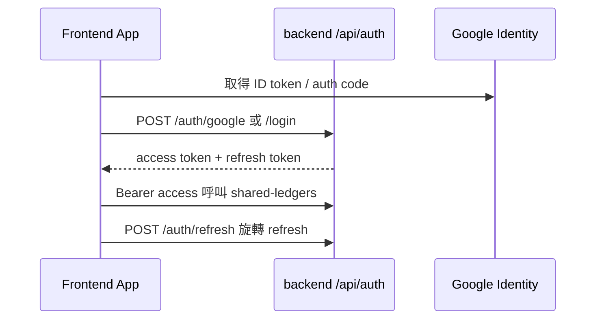

# Authentication

## 概述

StrawMoneyBook 採 **短效 access token + rotating refresh token** 模型。Google / Email 僅負責**身分驗證交換**；後端是 session 與權限中心，Google ID token 不滲透到其他 API。

完整設計紀錄：[`docs/google-backend-auth.md`](https://github.com/StrawCoding/StrawMoneyBook/blob/main/docs/google-backend-auth.md)

## Session 模型

| Token | 用途 | 儲存 |
|---|---|---|
| Access token | API `Authorization: Bearer` | memory / sessionStorage（Web） |
| Refresh token | 換發 access | HttpOnly cookie 或 native secure storage |
| Google ID token | 僅 `/auth/google` 交換 | 不持久化為 API 憑證 |

## 支援的登入方式

- Email + Password（註冊、登入、忘記密碼、臨時密碼）
- Google Sign-In（Web + Capacitor Android plugin）
- 後續可擴 Apple / 匿名升級

## Backend 端點

| 端點 | 說明 |
|---|---|
| `POST /api/auth/google/prepare` | 準備 Google 登入（非 credentialed CORS） |
| `POST /api/auth/google` | 驗證 ID token，建立 session |
| `POST /api/auth/refresh` | 旋轉 refresh，撤銷 reuse family |
| `POST /api/auth/logout` | 撤銷 session |
| `GET /api/auth/me` | 目前使用者 |

實作：[`backend/src/routes/auth/`](https://github.com/StrawCoding/StrawMoneyBook/tree/main/backend/src/routes/auth)

## Frontend 整合

| 模組 | 職責 |
|---|---|
| [`services/shared-ledger/backend.js`](https://github.com/StrawCoding/StrawMoneyBook/blob/main/frontend/src/services/shared-ledger/backend.js) | API client、session refresh、`useAuthStorage` credentialed 模式 |
| [`ui/services/google-identity.service.js`](https://github.com/StrawCoding/StrawMoneyBook/blob/main/frontend/src/ui/services/google-identity.service.js) | Google 登入 UI 流程 |
| [`SettingsAccountPage.vue`](https://github.com/StrawCoding/StrawMoneyBook/blob/main/frontend/src/ui/views/settings/SettingsAccountPage.vue) | 帳號設定頁 |

## Capacitor / 跨域 Cookie 策略

::: warning WebView 與 api.strawmb.com
Capacitor 使用 `https://localhost` 連正式 API 時：

- `auth-cookies.js` 依 Origin 與 API host 是否相同決定 refresh cookie 的 `SameSite` 政策
- 跨站（localhost → api.strawmb.com）使用 `SameSite=None; Secure`
- Native 平台 profile 存 `localStorage`；Web 用 sessionStorage + auth hint 支援冷啟動 cookie restore
:::

只有 `useAuthStorage: true` 的登入 / refresh / logout 才帶 cookie credentials；`/auth/google/prepare` 不應誤觸 credentialed CORS preflight。

## 資料表（Backend）

- `users` — email、profile、membership 相關
- `user_auth_providers` — Google sub、provider 綁定
- refresh session 表 — family id、rotation、revoke

詳見 [`google-backend-auth.md` §資料表設計](https://github.com/StrawCoding/StrawMoneyBook/blob/main/docs/google-backend-auth.md)。

## Google 自動備份 OAuth（獨立於登入 session）

Android 自動備份使用 **server auth code flow**，exchange / refresh 走 `/api/google/oauth/*`，需長效 refresh token（offline mode）。與帳號登入 session 共用 Google 身分但 token 生命周期分開管理。

## 下一步

- [Membership](/domains/membership)
- [Sync, Backup & Shared Ledger](/domains/sync-backup-shared-ledger)
