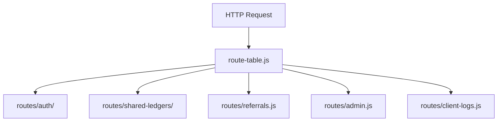

# Backend API

## 概述

Backend 是輕量 Node.js HTTP server，提供**帳號認證、共同帳本協作、邀請碼與管理 API**。不托管使用者完整帳本 SQLite；帳本內容以 snapshot JSON 在 shared ledger 流程中傳遞。

## 入口與路由

[`server.js`](https://github.com/StrawCoding/StrawMoneyBook/blob/main/backend/src/server.js) 建立 HTTP server，透過 [`routes/route-table.js`](https://github.com/StrawCoding/StrawMoneyBook/blob/main/backend/src/routes/route-table.js) 分派：

## API 模組

### Auth（`/api/auth/*`）

實作目錄：[`backend/src/routes/auth/`](https://github.com/StrawCoding/StrawMoneyBook/tree/main/backend/src/routes/auth)

| 端點（節錄） | 用途 |
|---|---|
| `POST /register`, `POST /login` | Email 註冊登入 |
| `POST /google/prepare`, `POST /google` | Google 登入交換 |
| `POST /refresh`, `POST /logout` | Session 旋轉 |
| `GET /me` | 目前使用者 profile |
| 密碼重設系列 | forgot / temp / reset |

詳見 [Authentication](/guide/authentication)。

### Shared Ledgers（`/api/shared-ledgers/*`）

實作目錄：[`backend/src/routes/shared-ledgers/`](https://github.com/StrawCoding/StrawMoneyBook/tree/main/backend/src/routes/shared-ledgers)

| 能力 | 說明 |
|---|---|
| 建立 / 查詢共同帳本 | Owner 建立，成員依角色存取 |
| 快照上傳 / 下載 | baseVersion 檢查，避免舊快照覆蓋 |
| Email 邀請 / 接受 | 含寄送狀態回報 |
| 角色更新 / 轉移所有權 | Viewer / Member / Admin / Owner 矩陣 |
| 邀請碼 rotate | 產生新 HTTPS 共享連結 |

Frontend client：[`services/shared-ledger/backend.js`](https://github.com/StrawCoding/StrawMoneyBook/blob/main/frontend/src/services/shared-ledger/backend.js)

### Referrals（`/api/referrals/*`）

邀請碼資訊、兌換、會員天數加成（邀請者 +7、被邀請者 +3）。

### Admin（`/api/admin/*`）

管理員總覽、會員調整、client error log 審核。

### Client Logs（`/api/client-logs`）

Frontend [`error-log.service.js`](https://github.com/StrawCoding/StrawMoneyBook/blob/main/frontend/src/ui/services/error-log.service.js) 上報去重後的錯誤事件。

## Collab Store 層

| 模組 | 職責 |
|---|---|
| [`collab/store.js`](https://github.com/StrawCoding/StrawMoneyBook/blob/main/backend/src/collab/store.js) | 共同帳本、快照、row-level diff 寫入 |
| [`collab/auth-store.js`](https://github.com/StrawCoding/StrawMoneyBook/blob/main/backend/src/collab/auth-store.js) | 使用者、provider、refresh session |
| [`collab/auth-session.js`](https://github.com/StrawCoding/StrawMoneyBook/blob/main/backend/src/collab/auth-session.js) | Bearer 驗證、admin 檢查 |
| [`collab/http.js`](https://github.com/StrawCoding/StrawMoneyBook/blob/main/backend/src/collab/http.js) | 共用 request/response helper |

持久化檔：`backend/.server-data/collab-store.sqlite`（production 掛載至 StrawMB volume）。

## 其他 Backend 能力

- **Google OAuth proxy**：`/api/google/oauth/*` — Android 自動備份 server auth code exchange
- **E-Invoice proxy**：`/api/einvoice/*` — 載具查詢代理財政部 API
- **Bank sync 錨點**：同步合約自檢腳本（見 bank-sync 域）

## 安全與限制

- Rate limit、body size 上限在 `server.js` 設定
- Shared ledger endpoint 依 [`store-shared-ledgers.js`](https://github.com/StrawCoding/StrawMoneyBook/blob/main/backend/src/collab/store-shared-ledgers.js) 角色矩陣檢查（Viewer 禁 push 等）

## 下一步

- [Authentication](/guide/authentication)
- [Sync, Backup & Shared Ledger](/domains/sync-backup-shared-ledger)
