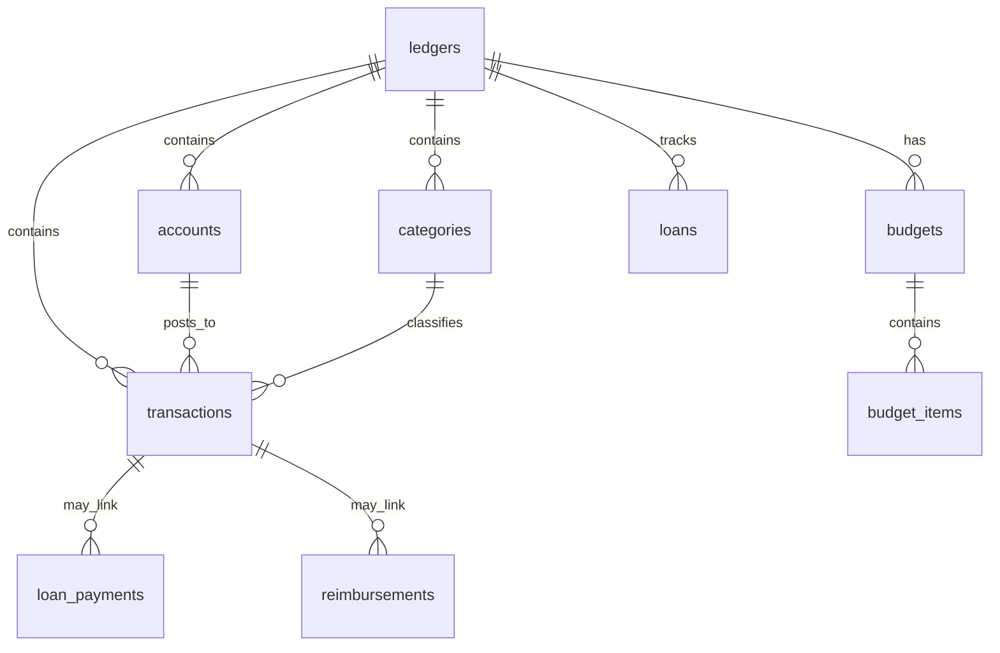

# Data Model & Storage

## 概述

StrawMoneyBook 帳本資料存在本機 **SQLite**。Web 開發使用 sql.js（WASM），Android 使用 Capacitor SQLite + SQLCipher。Schema 透過 migration 版本遞增，Repository 層封裝所有 SQL 存取。

## 儲存引擎

| 平台 | 引擎 | 備註 |
|---|---|---|
| Web / 本機 dev | sql.js + IndexedDB persist | 瀏覽器環境 |
| Android | `@capacitor-community/sqlite` | SQLCipher 加密 DB 檔 |
| Backend | better-sqlite3 | `collab-store.sqlite`，與 frontend 分離 |

Frontend DB 初始化入口：[`bootstrap.service.js`](https://github.com/StrawCoding/StrawMoneyBook/blob/main/frontend/src/core/services/bootstrap.service.js)  
Migration 目錄：[`frontend/src/core/db/migrations/`](https://github.com/StrawCoding/StrawMoneyBook/tree/main/frontend/src/core/db/migrations)

## 核心實體關係（簡化）

帳本（ledger）是根實體；交易（transaction）連接帳戶、分類，並可延伸借貸、報銷、退款、轉帳雙腿等關聯列。

## Repository 職責

目錄：[`frontend/src/core/repositories/`](https://github.com/StrawCoding/StrawMoneyBook/tree/main/frontend/src/core/repositories)

| Repository | 主要資料 |
|---|---|
| `ledger.repo.js` | 帳本 CRUD、排序 |
| `account.repo.js` | 帳戶、餘額、群組 |
| `category.repo.js` | 分類與群組 |
| `transaction.repo.js` | 交易 CRUD、軟刪、分頁查詢 |
| `budget.repo.js` | 預算期間、項目、共同池 |
| `loan.repo.js` | 借貸與還款 |
| `reimbursement.repo.js` | 報銷狀態 |
| `savings-jar.repo.js` | 存錢罐 |
| `bank-sync.repo.js` | 銀行連線設定 |
| `settings.repo.js` | 帳本級設定 |
| `base.repo.js` | 共用 helper |

::: tip 存取規則
View / Store **不應**直接寫 SQL。查詢類邏輯優先放 Service（如 `transaction-query.service.js`），持久化改 Repository。
:::

## 交易與 Posting

複雜記帳（轉帳雙腿、借貸 setup、報銷入帳、信用卡還款 allocations）的純領域規則放在：

- [`core/domain/posting/`](https://github.com/StrawCoding/StrawMoneyBook/tree/main/frontend/src/core/domain/posting)
- [`core/domain/balance/`](https://github.com/StrawCoding/StrawMoneyBook/tree/main/frontend/src/core/domain/balance)

Service 層（如 `transaction.service.js`）編排 posting 規則 + Repository 寫入。

## 快照與匯入

JSON 匯出 / 備份 / 共同帳本同步使用**帳本快照**格式。匯入前會：

1. `normalizeSharedLedgerSnapshot` — FK preserve（合成缺失父列，不刪減子列）
2. `assertBackupJsonStructureImportable` — 結構與 CHECK 約束驗證

詳見 [Sync, Backup & Shared Ledger](/domains/sync-backup-shared-ledger)。

## Foreign Key 政策

- 全程 `PRAGMA foreign_keys=ON`
- 禁止關閉 FK 或 silent no-op 修復
- SQLite FK 錯誤轉為 typed `SQLITE_CONSTRAINT_FOREIGNKEY` + i18n 訊息

## Backend 資料（協作域）

Backend 的 [`collab/store.js`](https://github.com/StrawCoding/StrawMoneyBook/blob/main/backend/src/collab/store.js) 管理：

- `users`、`user_auth_providers`
- `shared_ledgers` 與快照 blob
- refresh session、邀請、referral

與 frontend 本機 SQLite **不是同一份檔案**。

## 下一步

- [Frontend Stack](/guide/frontend-stack)
- [Bookkeeping](/domains/bookkeeping)
