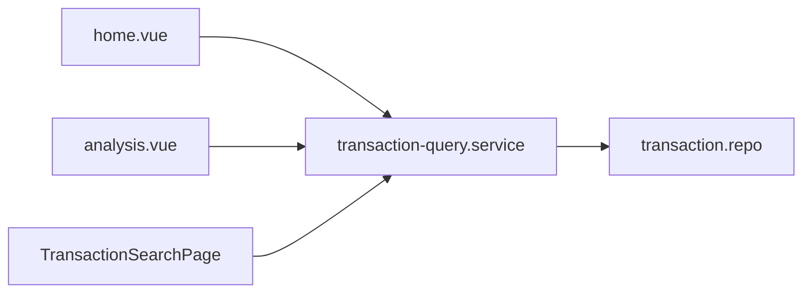

# Frontend Stack

## 概述

Frontend 是 Vue 3 SPA，以 Pinia 管理狀態、Vue Router 管理路由，Capacitor 包裝為 Android App。程式碼分為 `ui/`（呈現）、`core/`（領域邏輯）、`services/`（對外 API client）。

## 目錄結構

```text
frontend/src/
├── main.js                 # App 入口
├── core/
│   ├── db/                 # SQLite 連線、migration
│   ├── repositories/       # 資料存取
│   ├── services/           # 業務邏輯
│   ├── domain/             # 純函式領域規則
│   └── utils/
├── ui/
│   ├── views/              # 頁面
│   ├── components/         # 共用元件
│   ├── stores/             # Pinia
│   ├── services/           # runtime / sync / 平台
│   ├── router/
│   └── composables/
└── services/               # backend / Google HTTP client
```

## Pinia Store 職責

目錄：[`frontend/src/ui/stores/`](https://github.com/StrawCoding/StrawMoneyBook/tree/main/frontend/src/ui/stores)

| Store | 職責 |
|---|---|
| `ledger.store` | 活動帳本、帳本 CRUD、預算期間模式設定 |
| `account.store` | 帳戶清單、餘額、群組統計（含匯率換算） |
| `category.store` | 分類樹 |
| `transaction.store` | 交易載入、首頁篩選、CRUD action |
| `budget.store` | 預算期間、共同池、項目、getter（已用/剩餘/保留） |
| `loan.store` | 借貸清單、還款、作廢 |
| `reimbursement.store` | 報銷列表、自訂報銷金額 |
| `addon-template.store` | 附加項目模板快取 |
| `ui.store` | Toast 等全域 UI 狀態 |

Store action 應**委派** Core Service，避免在 Store 內寫業務規則。

## 查詢單一入口

[`transaction-query.service.js`](https://github.com/StrawCoding/StrawMoneyBook/blob/main/frontend/src/core/services/transaction-query.service.js) 統一：

- 首頁交易流（SQL 分頁，每頁 300 筆）
- 分析、搜尋、日曆、帳戶明細、交易編輯關聯載入



## 路由與 App Shell

路由定義：[`ui/router/index.js`](https://github.com/StrawCoding/StrawMoneyBook/blob/main/frontend/src/ui/router/index.js)

- 5 tab 底部導覽：首頁、預算、分析、功能列表、設定
- 記帳三模式共用 `BookkeepingPage.vue`（AI / 手動 / 問答）
- Deep link：`/open/shared-ledger`、`/shared-ledger/join` redirect 到設定頁

[`App.vue`](https://github.com/StrawCoding/StrawMoneyBook/blob/main/frontend/src/ui/App.vue) 控制 Welcome wizard、BottomNav、安全鎖 overlay。

## UI Service 層（平台與 Runtime）

| Service | 用途 |
|---|---|
| `app-bootstrap.service` | UI 啟動鏈 |
| `app-runtime.service` | 前景事件、背景排程 |
| `ledger-runtime.service` | 帳本 lifecycle |
| `shared-ledger.service` | 共同帳本流程 |
| `google-drive-ledger-sync.service` | GDrive 帳本同步 |
| `google-backup.service` / `webdav-backup.service` | 自動備份 |
| `theme.service` / `ui-layout.service` | 主題與 modern-only UI |
| `security-lock.service` | 生物辨識鎖 |

## 主要 Core Service（節錄）

完整清單見 [`StrawMoneyBook_Features_Map.md` §7](https://github.com/StrawCoding/StrawMoneyBook/blob/main/frontend/StrawMoneyBook_Features_Map.md)。

| Service | 域 |
|---|---|
| `transaction.service` | 記帳 CRUD、退款 |
| `budget.service` / `budget-save.service` | 預算與自動存罐 |
| `loan.service` | 借貸 |
| `reimbursement.service` | 報銷 |
| `ai-bookkeeping.service` | AI 解析 |
| `membership.service` | 會員限制 |
| `import.service` / `export.service` | 匯入匯出 |

## 測試

- Node test runner：`frontend/test/*.test.js`
- Playwright UI：`frontend` 內 playwright 腳本（layout、bank-sync 等）

## 下一步

- [Backend API](/guide/backend-api)
- [Bookkeeping](/domains/bookkeeping)
